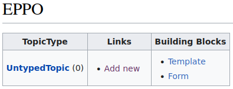
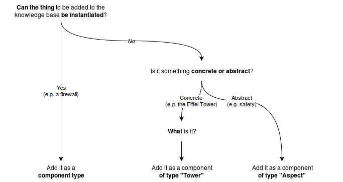

# mediawiki-pages-EPPO

This package implements the virtues of [Every Page is Page One](https://everypageispageone.com/the-book/), which are for information topics to *conform to a type*, *stay on one level* and to *link richly*. EPPO formalizes a way to **add information** to your knowledge base **as topics**.

## Features

* **Manage (add/edit/delete) information by EPPO topic type forms**<br/>*fill in title, blurb, free text, [dynamic properties](https://github.com/dataspects/mediawiki-pages-DynamicProperties) and topic type-specific properties*
* **Manage EPPO topic types**<br/>- *define topic type-specific properties*<br/>- *use templates, mainly `TopicMetaTemplate`, `FormHeader`, `StandardFormSections` and `FormFooter`*
* **View all EPPO topic types** at `wiki/EPPO` (<a href="#about-the-wiki-eppo-page">more information&hellip;</a>)<br/>
    

* **View an EPPO topic's instances** at `wiki/Example`:<pre>
{{TopicType}}
</pre>

* Simplify managing the forms that manage topics, e.g. `Form:YourTopicType` has this wikitext:<pre>
{{{info|add title=New YourTopicType|edit title=Edit YourTopicType|page name=C<unique number;random;10>}}}
{{FormHeader|YourTopicType}}
{{StandardFormSections}}
{{FormFooter|YourTopicType}}
</pre>

## LocalSettings
```
$wgPageFormsLinkAllRedLinksToForms = true;
```

## Development

* Consider automating the addition of a new EPPO topic type (#LEX2206031136)

## <a id="about-the-wiki-eppo-page"></a>About the `wiki/EPPO` page
<figure>
  
  <figcaption></figcaption>
</figure>